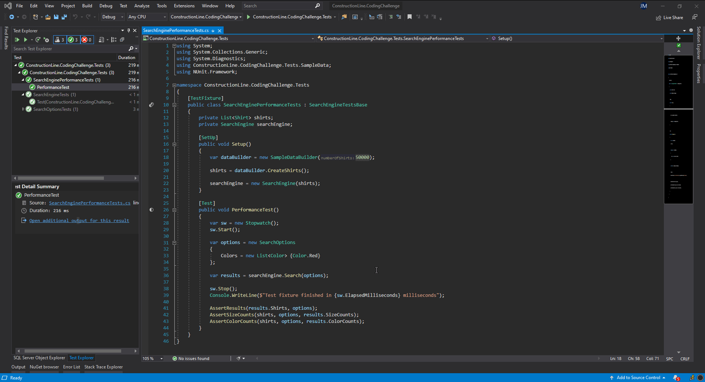

# Construction Line code challenge

The code challenge consists in the implementation of a simple search engine for shirts.

## What to do?
Shirts are in different sizes and colors. As described in the Size.cs class, there are three sizes: small, medium and large, and five different colors listed in Color.cs class.

The search specifies a range of sizes and colors in SearchOptions.cs. For example, for small, medium and red the search engine should return shirts that are either small or medium in size and are red in color. In this case, the SearchOptions should look like:

```
{
    Sizes = List<Size> {Size.Small, Size.Medium},
    Colors = List<Color> {Color.Red}
}
```

The results should include, as well as the shirts matching the search options, the total count for each search option taking into account the options that have been selected. For example, if there are two shirts, one small and red and another medium and blue, if the search options are small size and red color, the results (captured in SearchResults.cs) with total count for each option should be:
```
{
    Shirts = List<Shirt> { SmallRedShirt },
    SizeCounts = List<SizeCount> { Small(1), Medium(0), Large(0)},
    ColorCounts = List<ColorCount> { Red(1), Blue(0), Yellow(0), White(0), Black(0)}
}
```

The search engine logic sits in SearchEngine.cs and should be implemented by the candidate. Feel free to use any additional data structures, classes or libraries to prepare the data before the actual search. The initalisation of these should sit in the constructor of the search engine.

There are two tests in the test project; one simple search for red shirts out of a total of three, and another one which tests the performance of the search algorithm through 50.000 random shirts of all sizes and colors which measures how long it takes to perform the search algorithm. A reasonable implementation should not take more than 100 ms to return the results.

## Procedure
We would like you to send us a link to a git repository that we can access with your implementation.

The whole exercise should not take more than an hour to implement.

## Test Completion Details

Changes made:

- The `Search()` method of [SearchEngine.cs](/ConstructionLine.CodingChallenge/SearchEngine.cs) class now, 

  - Throws `ArgumentNullException` exception if the `SearchOptions` parameter is null,
  - Returns new `SearchResults` object with empty shirts list and count for `SizeCount` and `ColorCount` will be 0,
  - If shirts are available for search, it will get the search combination based on the `SearchOptions` parameter and generate the result based on shirts that are matching the search combinations. 
  - Test for the `Search()` method implemented is covered in [SearchEngineTests.cs](/ConstructionLine.CodingChallenge.Tests/SearchEngineTests.cs).

- A new method called `GenerateSearchCombination()` added to [SearchOptions.cs](/ConstructionLine.CodingChallenge/SearchOptions.cs)

  This method returns all search combinations (basically Cartesian Product of `List<Size>` and `List<Color>`)

  ```csharp
  var input = new SearchOptions
  {
      Sizes = new List<Size> {Size.Small, Size.Medium},
      Colors = new List<Color> {Color.Black, Color.Yellow, Color.Blue}
  };
  
  // should return the below combinations
  var output = new List<Tuple<Size, Color>>
  {
      new Tuple<Size, Color>(Size.Small, Color.Black),
      new Tuple<Size, Color>(Size.Small, Color.Yellow),
      new Tuple<Size, Color>(Size.Small, Color.Blue),
      new Tuple<Size, Color>(Size.Medium, Color.Black),
      new Tuple<Size, Color>(Size.Medium, Color.Yellow),
      new Tuple<Size, Color>(Size.Medium, Color.Blue)
  });
  ```

  Tests for the `GenerateSearchCombination()` method is covered under [SearchOptionsTests.cs](/ConstructionLine.CodingChallenge.Tests/SearchOptionsTests.cs)

- [SearchResults](/ConstructionLine.CodingChallenge/SearchResults.cs) class properties `SizeCounts` and `ColorCounts` are now `get` only properties. This will dynamically return count based on the `SearchResults.Shirts` list property.

### Performance Test 

Takes between 21 - 23 milliseconds to complete. 



## Build using PowerShell

Run the below command to build the solution locally;

Execute [build.ps1](/build.ps1) to compile application and package release artifacts. Outputs to `/dist/` folder.

The build script also outputs the code coverage result. The coverage report files can be found under `dist\Coverage` folder. After the build process is executed you can open the coverage report using `dist\Coverage\index.html`

